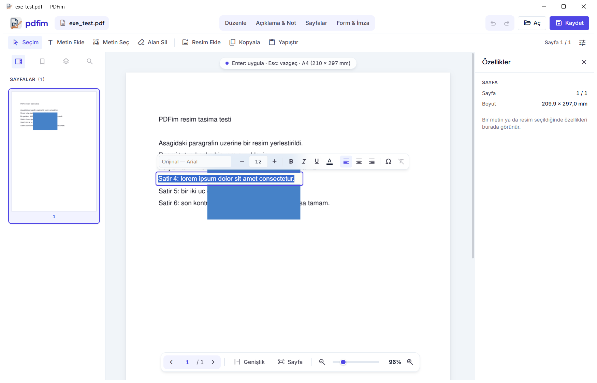
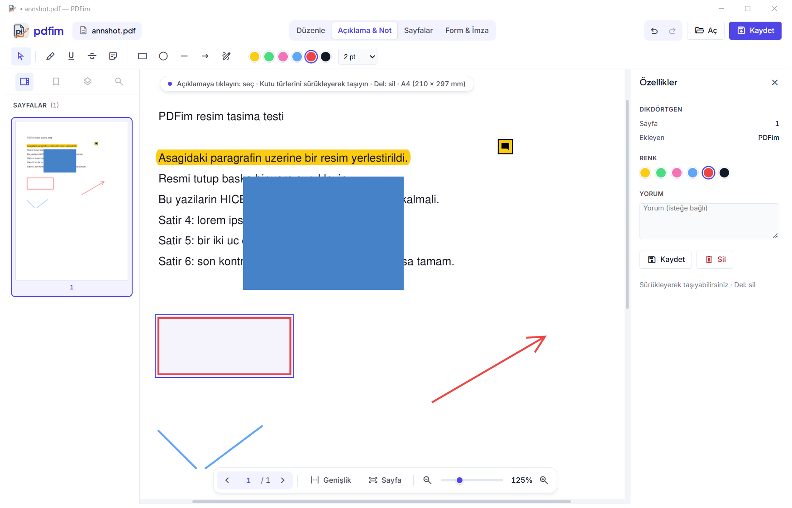
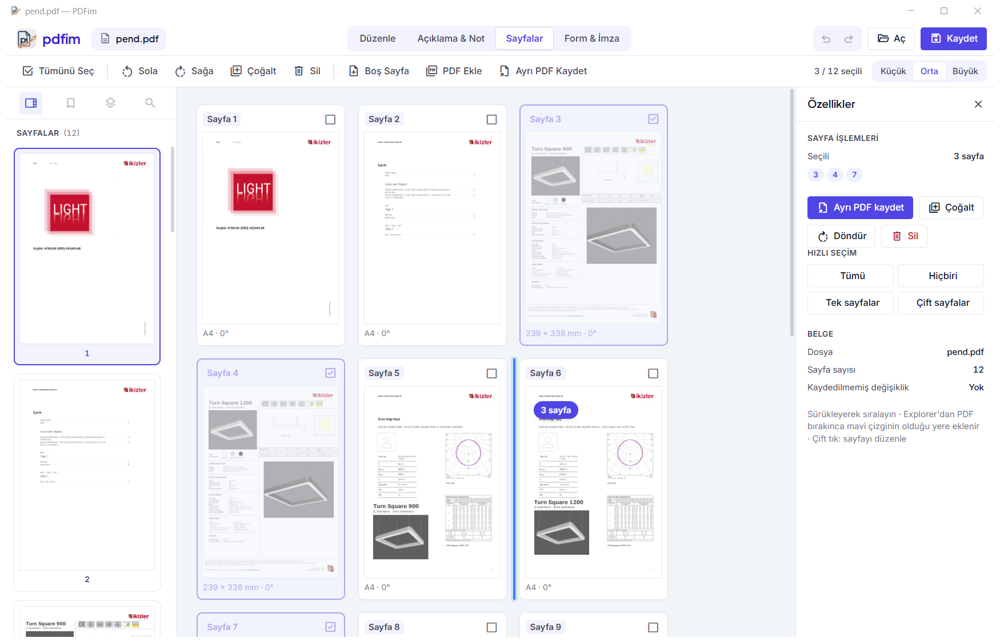
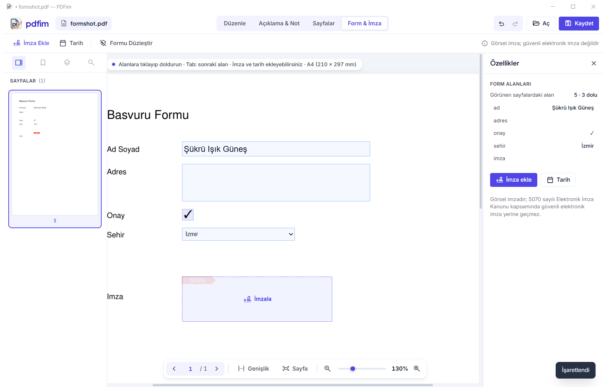
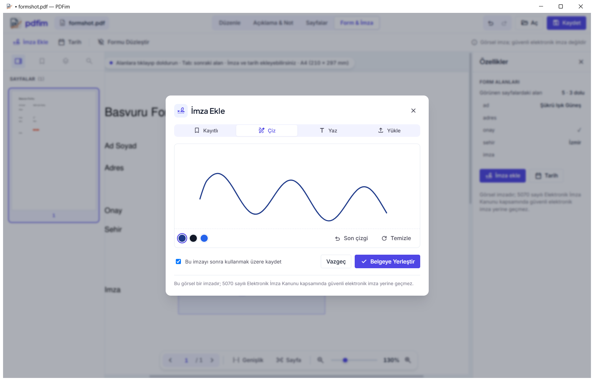

<p align="center"></p>

# PDFim

Windows için hafif bir PDF düzenleyici. Datasheet gibi teknik belgelerde küçük revizyonları
(bir değeri değiştirmek, logo eklemek, tablo kopyalamak, sayfaları sıralamak, formu doldurup
imzalamak) başka bir programa ihtiyaç duymadan yapmak için geliştirildi.



## İndirme

**[Son sürümü indir →](https://github.com/bakiucartasarim/pdfim/releases/latest)**

`PDFim_Setup_vX.Y.exe` dosyasını indirip çalıştırın. Yeni sürüm eskisinin üzerine kurulur.
Kurulumdan sonra PDF dosyalarına sağ tıklayıp **PDFim ile Aç** diyebilirsiniz.

Gereksinim: Windows 10 veya 11 (64 bit). Arayüz, Windows'ta kurulu gelen **WebView2**
bileşenini kullanır; eksikse kurulum sizi indirme sayfasına yönlendirir.

## Dört çalışma alanı

Üstteki sekmelerden geçilir: **Düzenle · Açıklama & Not · Sayfalar · Form & İmza**

### Düzenle

| Araç | Ne yapar |
|---|---|
| **Seçim** (Ctrl+1) | Metne tıkla: seç · sürükle: taşı · **çift tık: düzenle**. Resme tıkla: seç, taşı, köşeden boyutlandır |
| **Metin Ekle** (Ctrl+2) | Boş bir yere tıkla, yaz |
| **Metin Seç** (Ctrl+3) | Alan sürükle: içindeki metin panoya kopyalanır (tablolar Tab'lı, Excel'e yapışır) |
| **Alan Sil** (Ctrl+4) | Seçilen alanın üzeri beyazla kapatılır |
| **Resim Ekle** (Ctrl+I) | Resim, baktığınız sayfaya kendi oranıyla eklenir |

Metin düzenlenirken üstte **biçim çubuğu** açılır: font (kurulu fontlardan, aranabilir),
punto, **B** / *I* / U, renk, orijinal kutu içinde sola/ortaya/sağa yaslama, semboller
(², °, µ, ±, Ø …) ve biçimi sıfırlama. Varsayılan olarak belgedeki orijinal font kullanılır;
yazdığınız bir karakter o fontta yoksa (ör. `µ`, `Ş`) boş kutu yerine en yakın sistem fontuna geçilir.

Resimler sürüklenirken sayfa kenarlarına, ortasına, metin kenar boşluklarına ve diğer resimlere
**yapışır** (pembe kılavuz). **Alt**: serbest taşı · köşeden boyutlandırmada oran korunur,
**Shift**: oranı boz · sağ tık: hizala, sil.

**Yapıştırma:** boş bir yere **sağ tık → Buraya yapıştır** en hızlısı. Ctrl+V ile metnin gri
önizlemesi imleci takip eder, tıkladığınız yere yazılır ve metin kenarlarına yapışır. PDFim
içinden kopyalanan metin kaynağının font, punto ve kalınlığıyla yapışır; dışarıdan gelen metin
Arial 10 punto olur. Panodaki resim de yapıştırılabilir.

### Açıklama & Not



Vurgula, altını çiz, üstünü çiz (metnin üstünden sürükleyin), **not**, dikdörtgen, elips,
çizgi, ok ve serbest çizim; 6 renk ve çizgi kalınlığı. **Seç** aracıyla bir açıklamaya tıklayın:
sağ panelden rengini ya da notunu değiştirin, **Del** ile silin, kutu türlerini sürükleyerek taşıyın.

Bunlar standart PDF açıklama nesneleridir: Acrobat ya da Edge'de de ayrı öğe olarak görünür.
Belgede zaten var olan açıklamalar da listelenir ve düzenlenebilir.

### Sayfalar



Sayfaları **sürükleyerek sıralayın** (mavi çizgi bırakılacak yeri gösterir). Tıkla: seç ·
**Ctrl**: ekle/çıkar · **Shift**: aralık · hızlı seçim: tümü / tek / çift.
İşlemler: sola-sağa **döndür**, **çoğalt** (Ctrl+D), **sil** (Del), **boş sayfa**,
**başka bir PDF ekle**, **seçilenleri ayrı PDF olarak kaydet**. Explorer'dan sürüklenen PDF
mavi çizginin olduğu yere eklenir. Bir sayfaya çift tıklayınca Düzenle modunda açılır.

### Form & İmza



PDF form alanlarının üstünde doldurulabilir kutular çıkar: metin, onay kutusu, radyo düğmesi,
açılır liste. **Tab** ile sonraki alana geçilir. **Formu Düzleştir** değerleri sayfanın kalıcı
parçası yapar (geri alınabilir).

**İmza:** çizerek, yazarak (el yazısı fontlarıyla) ya da taranmış bir resimden (kâğıdın beyazı
otomatik silinir). İmzalar kaydedilip sonra tekrar kullanılabilir. İmza alanına tıklayınca alana
sığdırılır; **İmza Ekle** ile imleçle taşıyıp istediğiniz yere bırakırsınız. **Tarih** düğmesi
bugünün tarihini tıkladığınız yere yazar.



> Bu **görsel** bir imzadır; 5070 sayılı Elektronik İmza Kanunu kapsamında güvenli elektronik
> imza yerine geçmez.

## Kısayollar

| Kısayol | İşlem |
|---|---|
| Ctrl+O / Ctrl+S / Ctrl+Shift+S | Aç / Kaydet / Farklı kaydet |
| Ctrl+Z / Ctrl+Y | Geri al / Yinele (son 20 işlem) |
| Ctrl+1 / 2 / 3 / 4 | Seçim / Metin Ekle / Metin Seç / Alan Sil |
| Ctrl+C / Ctrl+V / Ctrl+A | Kopyala / Yapıştır / Sayfanın tüm metnini seç |
| Ctrl+B / Ctrl+I / Ctrl+U | Kalın / İtalik / Altı çizili (metin düzenlenirken) |
| Ctrl+I | Resim ekle (düzenleme kutusu kapalıyken) |
| Del | Seçili resmi, sayfayı ya da açıklamayı sil |
| Ctrl+D | Seçili sayfaları çoğalt (Sayfalar modu) |
| Ctrl+= / Ctrl+- / Ctrl+tekerlek | Yakınlaş / Uzaklaş |
| Ctrl+W / Ctrl+Shift+W | Genişliğe / Sayfaya sığdır |

## Bilinen sınırlamalar

PDF'te Word'deki gibi paragraf yapısı yoktur; her satır, hatta satır parçaları, sayfaya ayrı ayrı
yerleştirilmiştir. Bu yüzden:

- Düzenleme, tıklanan metin parçası düzeyinde yapılır. Uzun bir yazı yazılınca satır otomatik
  kaydırılmaz. İki yana yaslama, madde işareti ve satır aralığı yoktur.
- *Altı çizili* aslında metnin altına çizilen ayrı bir çizgidir. Metin sonradan taşınır veya
  tekrar düzenlenirse çizgi eski yerinde kalır; *Alan Sil* ile silinebilir.
- Orijinal dışında bir font seçmek, o fontu PDF'e gömer ve dosya boyutunu büyütebilir.
- **Döndürülmüş sayfalarda** (ör. yatay taranmış belgeler) düzenleme kapalıdır; tıklayınca
  nedenini söyler. Sayfaları Sayfalar modunda döndürmek de o sayfayı bu duruma sokar.
- Parolalı PDF'ler parola sorularak açılır. Taranmış (resim) PDF'lerde ve yazıları çizim olarak
  kaydedilmiş dosyalarda (ör. CAD çıktıları) metin düzenleme ve kopyalama çalışmaz.

Sorun olursa hata kaydı şurada tutulur: `%APPDATA%\PDFim\crash.log`

## Kaynaktan çalıştırma ve derleme

Python 3.12 gerekir.

```bash
python -m venv venv_build
venv_build\Scripts\pip install -r requirements.txt
venv_build\Scripts\python app.py [dosya.pdf]
```

Exe ve kurulum paketi:

```bash
venv_build\Scripts\python -m PyInstaller PDFim.spec --noconfirm --clean   # → dist\PDFim\
"C:\Program Files (x86)\Inno Setup 6\ISCC.exe" setup.iss                 # → dist\installer\
```

Sürüm numarası `bridge.py` içindeki `VERSION` ve `setup.iss` içindeki `MyAppVersion` alanlarında
tutulur; ikisi aynı olmalıdır.

| Dosya | İçerik |
|---|---|
| `app.py` | Giriş noktası: pencere (pywebview → WebView2), sürükle-bırak, kapanışta kayıt uyarısı |
| `bridge.py` | Arayüzün çağırdığı bütün işlemler (JS ↔ Python köprüsü), geri alma, sayfa sürümleri |
| `editor.py` | PyMuPDF üzerinden PDF işlemleri: metin, resim, sayfa, form, açıklama, kayıt |
| `page_server.py` | Sayfa görüntülerini arayüze veren yerel sunucu (belirteçli, yalnız 127.0.0.1) |
| `fonts.py` | Kurulu fontları bulma ve PDF font adlarıyla eşleştirme |
| `clipboard.py` | Windows panosu (metin ve resim) |
| `ui/` | Arayüz: `index.html`, `css/`, `js/` (`layer.js` sayfa etkileşimi, `pages.js`, `form.js`, `signature.js`, `annot.js`) |

Kullanılan kütüphaneler: [PyMuPDF](https://pymupdf.readthedocs.io/) ve
[pywebview](https://pywebview.flowrl.com/). Arayüz tasarımı `docs/tasarim/` altındadır.

## Lisans

PDFim, [GNU Affero General Public License v3.0](LICENSE) ile lisanslanmış açık kaynak bir yazılımdır.
PDF işlemleri için kullanılan PyMuPDF de AGPL lisanslıdır.
