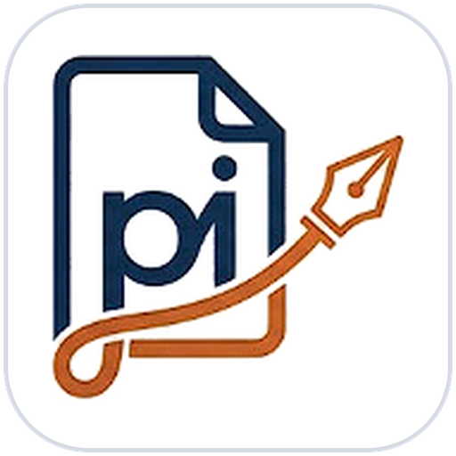
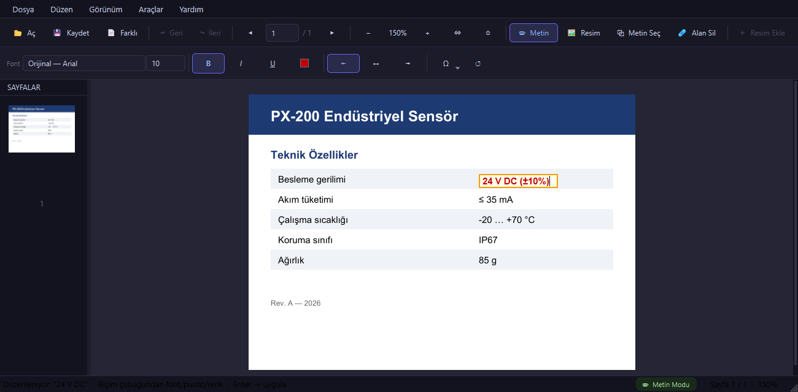
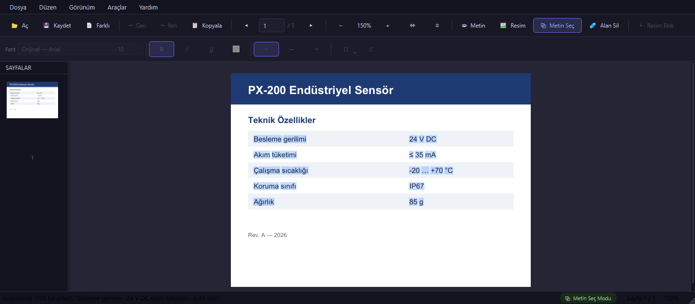
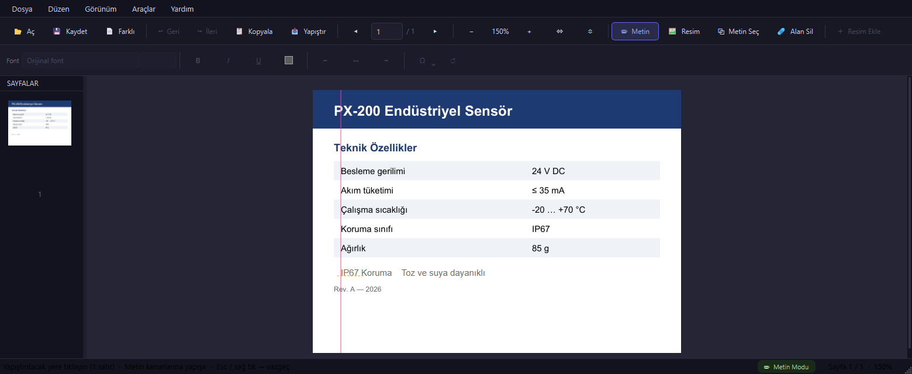

<p align="center"></p>

# PDFim

Windows için hafif bir PDF düzenleyici. Datasheet gibi teknik belgelerde küçük revizyonları
(bir değeri değiştirmek, logo eklemek, tablo kopyalamak) başka bir programa ihtiyaç duymadan
yapmak için geliştirildi.



## İndirme

**[Son sürümü indir →](https://github.com/bakiucartasarim/pdfim/releases/latest)**

`PDFim_Setup_vX.Y.exe` dosyasını indirip çalıştırın. Yeni sürüm eskisinin üzerine kurulur.
Kurulumdan sonra PDF dosyalarına sağ tıklayıp **PDFim ile Aç** diyebilirsiniz.

Gereksinim: Windows 10 veya 11 (64 bit).

## Özellikler

### Metin düzenleme
- Metne **çift tıklayın**, yazın, **Enter** ile uygulayın (**Esc** vazgeçer).
- Metni tıklayıp **sürükleyerek** taşıyın.
- Varsayılan olarak belgedeki orijinal font kullanılır. Yazdığınız bir karakter o fontta yoksa
  (ör. `µ`, `Ş`) boş kutu yerine en yakın sistem fontuna geçilir.

### Biçim çubuğu
Bir metin düzenlenirken üstteki ikinci satır etkinleşir:

| Kontrol | Ne yapar |
|---|---|
| Font | Kurulu Windows fontlarından seçim. İsimle arama yapılabilir. "Orijinal" belgedeki fontu korur. |
| Punto | Listeden seçin veya yazın (`10,5` gibi). |
| **B** / *I* / U | Kalın, italik, altı çizili. |
| ■ | Metin rengi. |
| ⇤ ↔ ⇥ | Orijinal metnin kutusu içinde sola yasla / ortala / sağa yasla. Tablodaki sağa yaslı değerler için sağa yaslayı kullanın. |
| Ω | ², °, µ, Ω, ±, ≤, Ø gibi semboller. |
| ↺ | Biçimi orijinal hâline döndürür. |

### Metin kopyalama



- **Metin modunda:** bir metne tıklayıp araç çubuğundaki **📋 Kopyala** düğmesine ya da **Ctrl+C**'ye
  basın. **Sağ tık** menüsünde *Kopyala*, *Satırın tamamını kopyala* ve *Sayfadaki tüm metni kopyala* var.
- **Metin Seç modunda (Ctrl+3):** bir alanı sürükleyerek seçin; seçilen kelimeler vurgulanır ve
  otomatik kopyalanır. **Ctrl+A** ekrandaki sayfanın tamamını seçer.
- Tablolar sütunlar arasında **Tab** karakteriyle kopyalanır; Excel'e yapıştırınca hücrelere dağılır.

### Yapıştırma



En hızlısı: sayfada boş bir yere **sağ tıklayın → Buraya yapıştır**. Metnin sol üst köşesi
(ya da resmin sol üst köşesi) tıkladığınız noktaya gelir. Resimler ekrandaki doğal boyutunda eklenir.

Ya da **📥 Yapıştır** düğmesi veya **Ctrl+V**:
- **Metin:** metnin gri önizlemesi imleci takip eder. Sayfada nereye tıklarsanız oraya yazılır.
  Önizleme mevcut metinlerin kenarlarına yapışır (pembe çizgi), böylece yeni metin hizalı olur.
  **Esc** veya **sağ tık** vazgeçer.
  - PDFim içinden kopyaladığınız metin kaynağın font, punto ve kalınlığıyla yapışır. Dışarıdan
    (Word, e-posta …) gelen metin Arial 10 punto olur.
  - Çok satırlı metin alt alta yazılır. Açık renkli metin (ör. koyu bant üstündeki beyaz başlık)
    beyaz sayfada görünmez olmasın diye siyah yapıştırılır.
- **Resim:** panodaki resim (ör. Ekran Alıntısı Aracı ile alınmış bir görüntü ya da kopyalanmış bir
  logo) ekrandaki sayfaya eklenir ve seçili gelir; hemen sürükleyip hizalayabilirsiniz.
- Bir metin düzenlenirken Ctrl+V düzenleme kutusunun içine yapıştırır.

Yapıştırılan metin normal metin gibi çift tıklanarak düzenlenebilir.

### Resimler (Resim modu, Ctrl+2)
- **Resim Ekle (Ctrl+I):** resim, ekranda baktığınız sayfaya kendi en/boy oranıyla eklenir.
- Sürüklerken sayfa kenarlarına, sayfanın ortasına, metin kenar boşluklarına ve diğer resimlere
  **yapışır** (pembe kılavuz çizgi). Serbest taşımak için **Alt** tuşunu basılı tutun.
- Köşeden boyutlandırmada oran korunur; oranı bozmak için **Shift** tuşunu basılı tutun.
- **Sağ tık:** Sola / Ortaya / Sağa, Üste / Ortaya / Alta hizala, Sil.

### Diğer
- **Alan Sil (Ctrl+4):** seçilen alanın üzeri beyazla kapatılır.
- Geri al / yinele (son 20 işlem), son açılan dosyalar, sayfa küçük resimleri.
- Pencere daraldığında araç çubuğu düğmeleri sadece ikon gösterir; üzerine gelince adı ve kısayolu görünür.
- Güvenli kayıt: kayıt yarıda kesilirse orijinal dosya bozulmaz. Dosya başka bir programda
  (ör. Adobe) açıksa bunu söyler ve *Farklı Kaydet* önerir.

## Kısayollar

| Kısayol | İşlem |
|---|---|
| Ctrl+O / Ctrl+S / Ctrl+Shift+S | Aç / Kaydet / Farklı kaydet |
| Ctrl+Z / Ctrl+Y | Geri al / Yinele |
| Ctrl+1 / 2 / 3 / 4 | Metin / Resim / Metin Seç / Alan Sil modu |
| Ctrl+C / Ctrl+V / Ctrl+A | Kopyala / Yapıştır / Sayfanın tüm metnini seç |
| Ctrl+B / Ctrl+U | Kalın / Altı çizili (düzenleme sırasında) |
| Ctrl+I | Resim ekle (Resim modunda) |
| Ctrl+= / Ctrl+- / Ctrl+tekerlek | Yakınlaş / Uzaklaş |
| Ctrl+W / Ctrl+Shift+W | Genişliğe / Sayfaya sığdır |

## Bilinen sınırlamalar

PDF'te Word'deki gibi paragraf yapısı yoktur; her satır, hatta satır parçaları, sayfaya ayrı ayrı
yerleştirilmiştir. Bu yüzden:

- Düzenleme, tıklanan metin parçası düzeyinde yapılır. Uzun bir yazı yazılınca satır otomatik
  kaydırılmaz.
- İki yana yaslama, madde işareti ve satır aralığı yoktur.
- *Altı çizili* aslında metnin altına çizilen ayrı bir çizgidir. Metin sonradan taşınır veya
  tekrar düzenlenirse çizgi eski yerinde kalır; *Alan Sil* ile silinebilir.
- Orijinal dışında bir font seçmek, o fontu PDF'e gömer ve dosya boyutunu büyütebilir.
- Parolalı PDF'ler parola sorularak açılır. Taranmış (resim) PDF'lerde metin düzenleme ve
  kopyalama çalışmaz.

Sorun olursa hata kaydı şurada tutulur: `%APPDATA%\PDFim\crash.log`

## Kaynaktan çalıştırma ve derleme

Python 3.12 gerekir.

```bash
python -m venv venv_build
venv_build\Scripts\pip install -r requirements.txt
venv_build\Scripts\python main.py [dosya.pdf]
```

Exe ve kurulum paketi:

```bash
venv_build\Scripts\python -m PyInstaller PDFim.spec --noconfirm --clean   # → dist\PDFim\
"C:\Program Files (x86)\Inno Setup 6\ISCC.exe" setup.iss                 # → dist\installer\
```

Sürüm numarası `setup.iss` içindeki `MyAppVersion` ve `main.py` içindeki *Hakkında* penceresinde tutulur.

| Dosya | İçerik |
|---|---|
| `main.py` | Ana pencere, menüler, dosya ve düzenleme akışı |
| `viewer.py` | Sayfa görüntüleme, fare etkileşimi, düzenleme kutusu, hizalama kılavuzları |
| `editor.py` | PyMuPDF üzerinden PDF işlemleri (metin, resim, kayıt, kopyalama) |
| `format_bar.py` | Biçim çubuğu |
| `fonts.py` | Kurulu Windows fontlarını bulma ve PDF font adlarıyla eşleştirme |

Kullanılan kütüphaneler: [PyMuPDF](https://pymupdf.readthedocs.io/) ve [PyQt6](https://www.riverbankcomputing.com/software/pyqt/).
